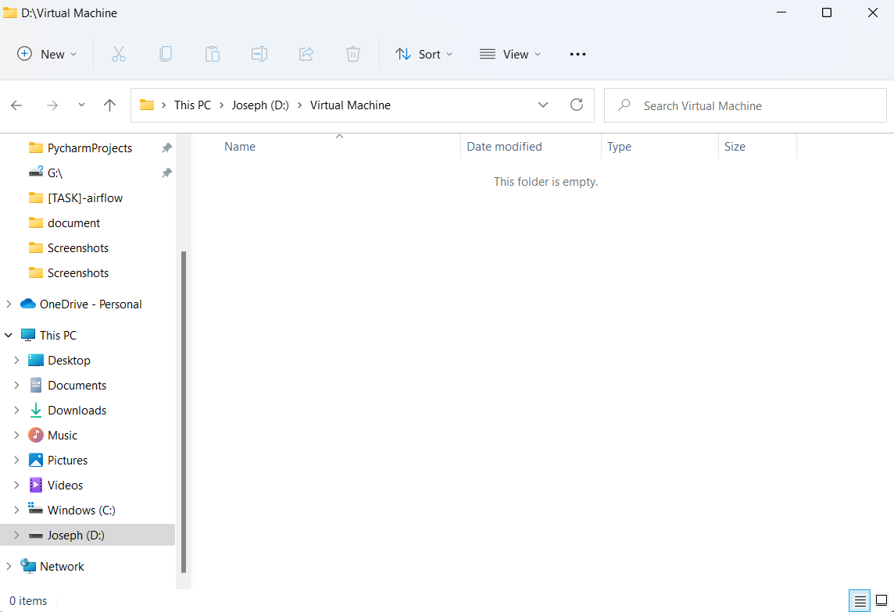
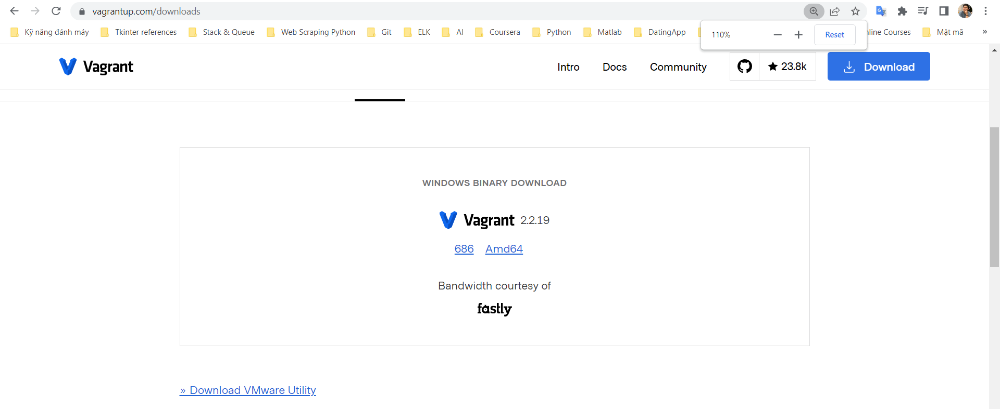
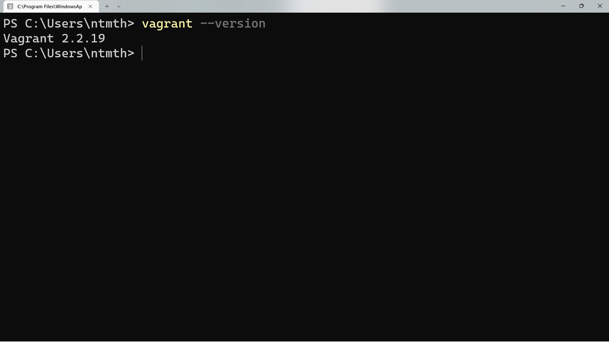
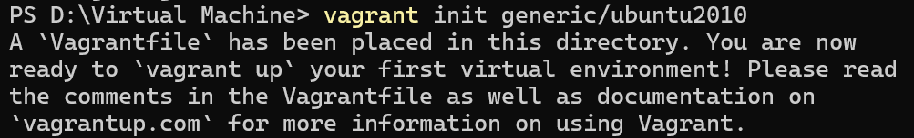
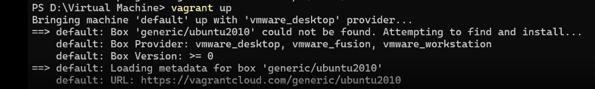
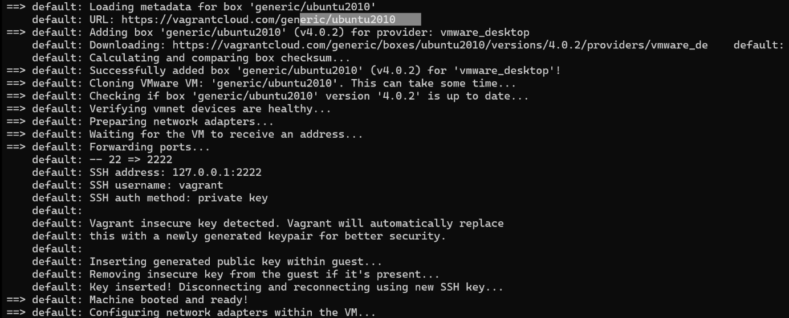
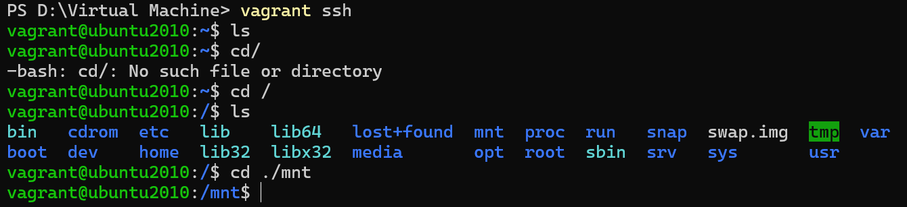

<!DOCTYPE html>
<html>
<style>
    head {text-align: center}
    body {background-color: powerblue;}
    th {
        text-align: center; 
        font-weight:"bold";
        font-size: 20px;
    }
    p {font-size: 15px;}
    h2 {font-weight: bold;}
    h1 {font-weight: bold;
        font-size:30px;}
</style>

<body>

<table>
    <th style="font-size: 30px;">Table of contents</th>
    <tr>
        <th><a href="#C1">Introduction</a></th>
    </tr>
    <tr>
        <th><a href="#C2">Installation</a></th>
    </tr>
    <tr>
        <th><a href="#C3">Usage</a></th>
    </tr>
    <tr>
        <th><a href="#C4">Contributing</a></th>
    </tr>
    <tr>
        <th><a href="#C5">Reference</a></th>
    </tr>
</table>

<br>

<h1> HOW TO INSTALL UBUNTU VIA VAGRANT </h1>

<h2 id="C1">Introduction</h2>
<hr>

<p>Vagrant is an open-source software product for building and maintaining portable virtual software development environments; e.g., for VirtualBox, KVM, Hyper-V, Docker containers, VMware, and AWS. It tries to simplify the software configuration management of virtualization in order to increase development productivity. Vagrant is written in the Ruby language, but its ecosystem supports development in a few other languages. (<a href="https://en.wikipedia.org/wiki/Vagrant_(software))">Wikipeadia</a>
)</p>

<h2 id="C2">Installation</h2>
<hr>

<p>Initially, we create a <b>"Virtual Machine"</b> folder in your <b>File Explorer</b>.</p>



<br>

<p>Download Vagrant via this link: <a href="https://www.vagrantup.com/downloads">https://www.vagrantup.com/downloads</a></p>

<p>After that, we choose <q style="font-weight: bold;">Amd64</q> in the picture below:</p>



<br>

<p>We need follow the wizard and then we will check whether it exists:</p>

```bash
vagrant --version
```



<br>

<h2 id="C3">Usage</h2>
<hr>

<p>Next, we initialize the <b>Vagrant</b> on the terminal console with <b>Administrators</b> permissions.</p>

```bash
vagrant init generic/ubuntu2010
```



<br>

<p>It will appear in your folder:</p>


<br>

<p>Then we install <b>VMware</b> as providers:</p>

```bash
vagrant plugin install vagrant-vmware-desktop
```


<br>

<p>After installing VMware providers, we activate Vagrant by a command below:</p>

```bash
vagrant up
```




<br>

<p>Finally, we open ubuntu kernel with <b>"ssh" keyword</b>.</p>

```bash
vagrant ssh
```



<br>

<p>From here, we're able to access ubuntu kernel and do your works.</p>

<h2 id="C4">Contributing</h2>
<hr>

<p>Pull requests are welcome. For major changes, please open an issue first to discuss what you would like to change.

Please make sure to update tests as appropriate</p>

<h2 id="C5">References</h2>
<hr>

<a href="https://www.vagrantup.com/">https://www.vagrantup.com/</a>

<a href="https://app.vagrantup.com/boxes/search">https://app.vagrantup.com/boxes/search</a>

</body>
</html>